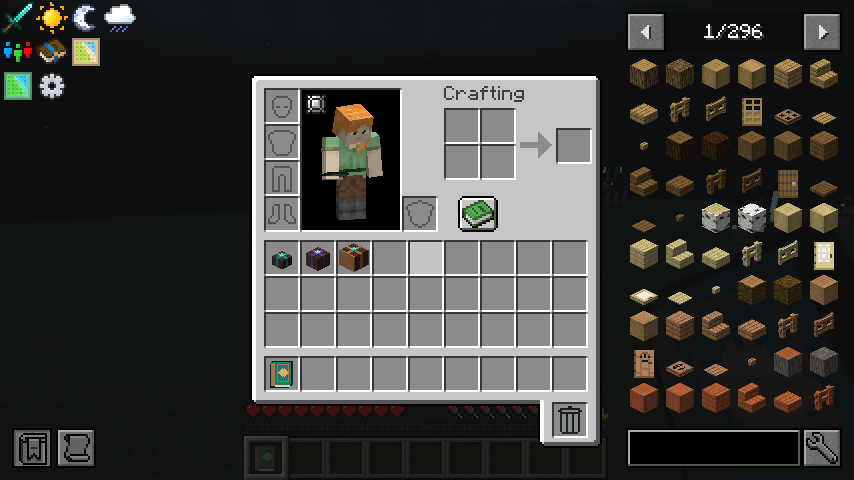

# Steward caches

The Nine Tribes set aside provisions for the Clowders who would follow. These sealed parcels reward steady progress without handing out machinery or bypassing the Loom.

- **Small:** two weighted supply rolls: bread, torches, bone meal, string, clay, saplings or wheat seeds.
- **Medium:** five rolls, adding leather, copper, iron nuggets and flower pots to a practical supply pool.
- **Large:** twelve rolls, including food, growing supplies, leather, copper, small quantities of iron or gold, lanterns, books, honeycomb and occasional bottled experience.

Use a cache to unwrap it. Rolls can repeat; a particular item is never guaranteed. Four unopened small caches craft into one medium; three unopened mediums craft into one large. Combining trades some total basic-supply rolls for a broader pool and denser parcels. There is no downgrade recipe and opened supplies cannot be repacked.

The new pools contain no machines, equipment, progression tokens, caches, Thread currency or extra lives. They do not drop from mobs. Six existing milestone rewards still grant the campaign's rare shared lives. The ten older, tribe-specific milestone caches keep their separate themed loot pools.

The 0.6.1 audit found 1,441 of 1,495 quests awarding Threads, with 1,211 awarding only Threads. Version 0.6.2 adds 381 small, 104 medium and six large caches across 491 quests. Existing Thread rewards and the repeatable Desk shop are unchanged. Every third eligible quest within a chapter receives a cache; occasional larger parcels replace that small-cache allocation. The first cache in each chapter explains the system.

## Existing worlds

All existing quest, task and reward identifiers are retained. New cache rewards have new identifiers, so completed quests may offer their newly added cache without resetting progress or reopening previously claimed rewards. The three item registrations are additive. World, team, life and island data formats are unchanged. Update the server and all clients together.

## Implementation and validation

`StewardCacheItem` rolls the datapack loot table on the server before consuming one sealed cache. A missing or empty table preserves it. A short use cooldown guards rapid repeated opening. Inventory overflow drops at the player's feet. Survival consumes one cache; creative follows Minecraft's normal item-consumption rules.

Loot pools live in `data/ninjacatskies/loot_table/provisions`, combining recipes in `data/ninjacatskies/recipe`, and recipe-book unlocks in `data/ninjacatskies/advancement/recipes/misc`. Models use native Minecraft cuboids, woven wood, colored bands and the existing animated Loom seal.

`tools/gates/test_steward_caches.py` checks bounded allowlisted supplies, combining inputs, reward distribution, preserved Thread awards and the complete pre-update quest-object identifier digest. Server GameTests open all three tiers and exercise cooldown and full-inventory behavior.
